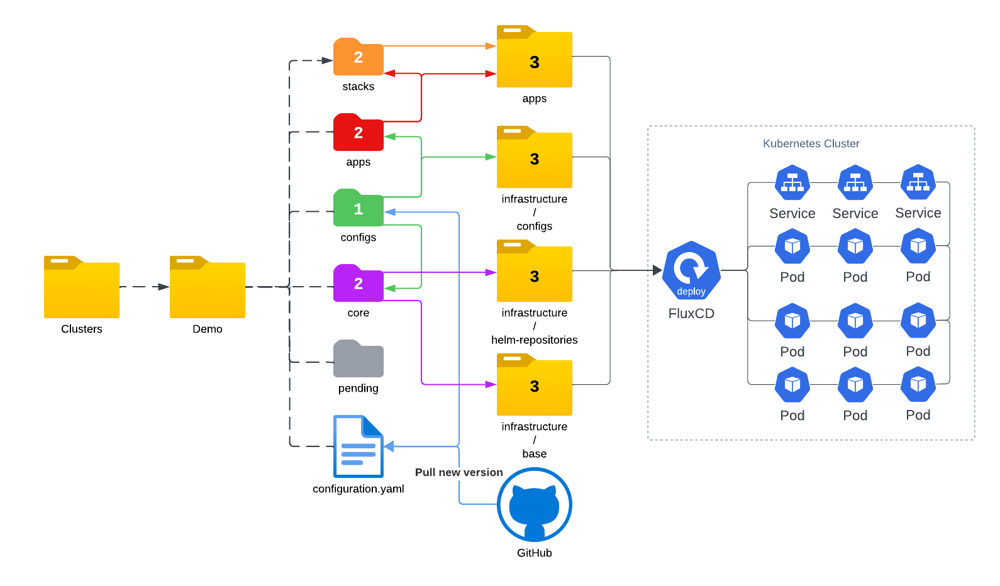

## Intro

This repo demonstrate how I manage my home lab cluster with flux. You can also find some `app units` from this repo and use it on your own cluster.

For more information, please check the [blog post](https://tech.aufomm.com/how-to-use-flux-to-manage-kubernetes-declaratively/#Encryption-by-user).